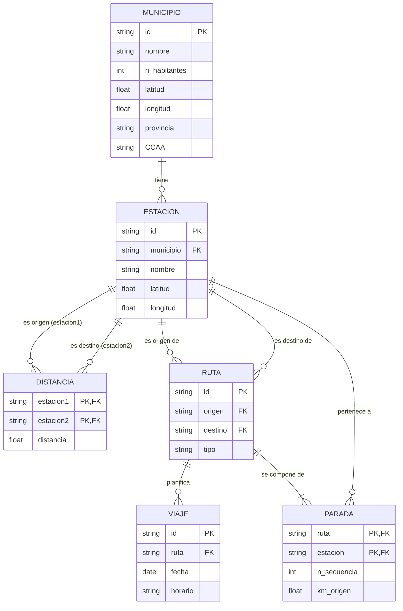

# Tren-ES 

## Supuesto elegido

Hemos elegido realizar la práctica sobre un supuesto propio, distinto de los propuestos. El objetivo consiste en construir un agregador que integre información acerca de la situación ferroviaria nacional. El sistema relacionará información sobre las estaciones, rutas y viajes en tren por el territorio español. El objetivo final será realizar las siguientes consultas:

1. Estaciones de tren en poblaciones de menos de 10000 habitantes.
2. Viajes entre dos estaciones a menos de 30 km entre si.
3. Poblaciones de entre 20000 y 100000 habitantes en las que haya menos de cinco viajes programados hoy.

* Estacion(**id**, nombre, _municipio_, latitud, longitud)
* Municipio(nombre, n_habitantes, **id**, latitud, longitud, provincia, CCAA)
* Viaje(**id**, _ruta_, fecha, horario)
* Parada(***ruta***, ***estacion***, n_secuencia, km_origen)
* Ruta(**id**, _origen_, _destino_, tipo)
* Distancia(***estacion1***, ***estacion2***, distancia)

