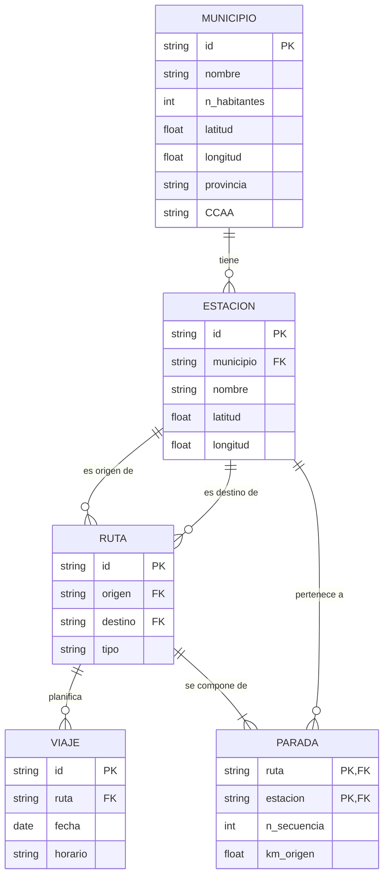

* Estacion(**id**, nombre, _municipio_, latitud, longitud)
* Municipio(nombre, n_habitantes, **id**, latitud, longitud, provincia, CCAA)
* Viaje(**id**, _ruta_, fecha, horario)
* Parada(***ruta***, ***estacion***, n_secuencia, km_origen)
* Ruta(**id**, _origen_, _destino_, tipo)

