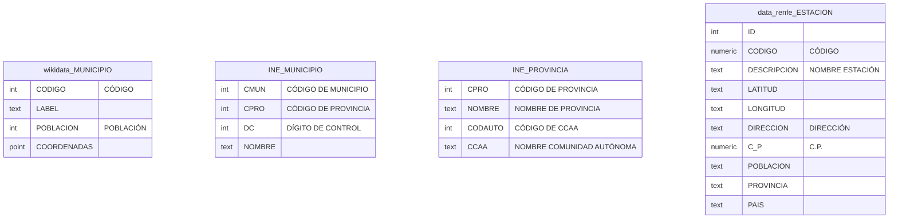
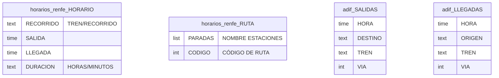

# Esquemas Origen

En este documento se muestran los esquemas de las fuentes de datos origen de nuestro sistema integrador Tren-ES. Las fuentes de datos son las siguientes

- WikiData. Para obtener información de los municipios, como su nombre, código del INE, coordenadas geográficas o la población)
- INE. Para conectar los códigos de los municipios con las provincias y comunidades autónomas.
- Renfe. Dos distintas:
    - Renfe Data. Obtenemos información a partir de la api de renfe de todas las estaciones que existen en españa.
    - Renfe horarios. Un pequeño formulario desde el que se puede obtener la información de todos los horarios de tramos (Estación Origen, Estación Destino) disponibles en la web de renfe y las rutas correspondientes.
- ADIF. Información en tiempo real de las salidas y llegadas en cada estación. Nos permite contrastar los horarios planificados con los reales.

