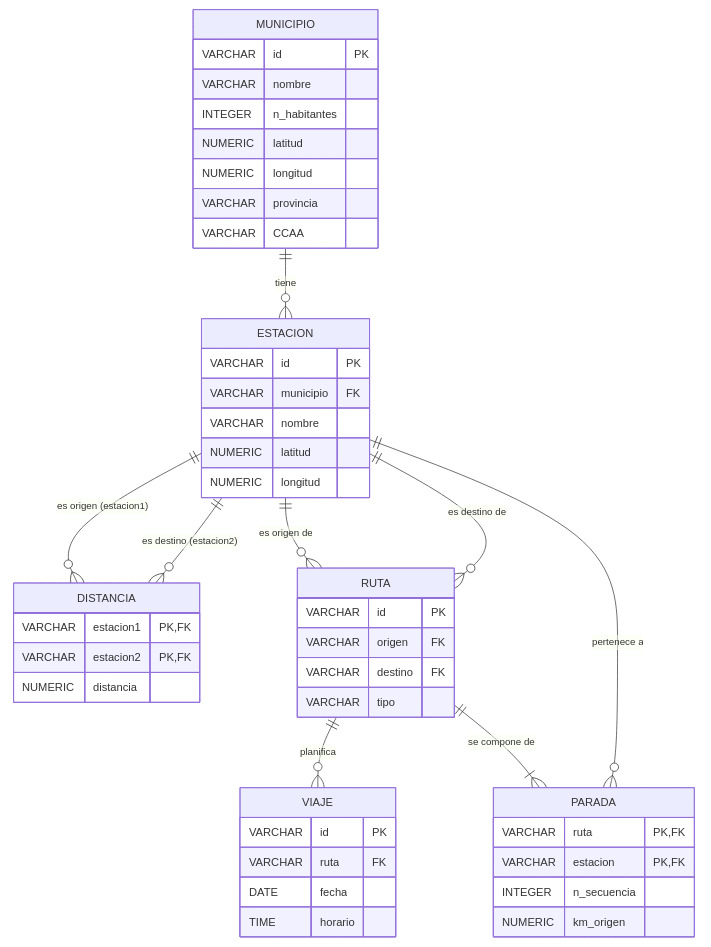

# Tren-ES

## Supuesto elegido

Hemos elegido realizar la práctica sobre un supuesto propio, distinto de los propuestos. El objetivo consiste en construir un agregador que integre información acerca de la situación ferroviaria nacional. El sistema relacionará información sobre las estaciones, rutas y viajes en tren por el territorio español. El objetivo final será realizar las siguientes consultas:

1. Estaciones de tren en poblaciones de menos de 10000 habitantes.
2. Viajes entre dos estaciones a menos de 30 km entre sí.
3. Poblaciones de entre 20000 y 100000 habitantes en las que haya menos de cinco viajes programados hoy.

## Esquema mediador

Para modelar la información del sistema se ha definido un esquema mediador compuesto por seis relaciones principales: **Estacion**, **Municipio**, **Viaje**, **Parada**, **Ruta** y **Distancia**. Este esquema permite representar tanto la estructura geográfica del sistema ferroviario como la planificación de trayectos y viajes.

Las relaciones del esquema mediador son las siguientes:

* Estacion(**id**, nombre, _municipio_, latitud, longitud)
* Municipio(nombre, n_habitantes, **id**, latitud, longitud, provincia, CCAA)
* Viaje(**id**, _ruta_, fecha, horario)
* Parada(***ruta***, ***estacion***, n_secuencia, km_origen)
* Ruta(**id**, _origen_, _destino_, tipo)
* Distancia(***estacion1***, ***estacion2***, distancia)

A continuación se describe brevemente cada una de las tablas y los atributos que la componen.

### Tabla Estacion

La tabla **Estacion** guarda la información de las estaciones de tren registradas en el sistema. Cada estación está asociada a un municipio concreto.

Sus atributos son:

- **id**: clave primaria de la tabla. Identifica de forma única cada estación.
- **nombre**: nombre de la estación.
- **municipio**: clave foránea que referencia al atributo **id** de la tabla **Municipio**. Indica el municipio en el que se encuentra situada la estación.
- **latitud**: coordenada geográfica de latitud de la estación.
- **longitud**: coordenada geográfica de longitud de la estación.

### Tabla Municipio

La tabla **Municipio** almacena la información básica de cada municipio incluido en el sistema. En ella se recogen tanto datos identificativos como datos demográficos y geográficos.

Sus atributos son:

- **id**: clave primaria de la tabla. Identifica de manera única cada municipio.
- **nombre**: nombre del municipio.
- **n_habitantes**: número de habitantes del municipio.
- **latitud**: coordenada geográfica de latitud del municipio.
- **longitud**: coordenada geográfica de longitud del municipio.
- **provincia**: provincia a la que pertenece el municipio.
- **CCAA**: comunidad autónoma a la que pertenece el municipio.

### Tabla Viaje

La tabla **Viaje** almacena los viajes concretos programados en el sistema. Mientras que una ruta define un recorrido general, un viaje representa una realización específica de dicha ruta en una fecha y hora determinadas.

Sus atributos son:

- **id**: clave primaria de la tabla. Identifica de forma única cada viaje.
- **ruta**: clave foránea que referencia al atributo **id** de la tabla **Ruta**. Indica qué ruta realiza el viaje.
- **fecha**: fecha en la que está programado el viaje.
- **horario**: hora programada para la salida del viaje.

### Tabla Parada

La tabla **Parada** almacena las estaciones por las que pasa una ruta, guardando el orden de llegada planificado en la ruta a la que pertenece. Esta tabla NO tiene en cuenta lla existencia de rutas circulares (que por otra parte creemos que no existen en recorridos de alta y media distancia). Consideramos que las rutas tienen un origen y un destino, con una serie de paradas intermedias.

Sus atributos son:

- **ruta**: clave foránea que referencia al atributo **id** de la tabla **Ruta**. Forma parte de la clave primaria compuesta de la tabla.
- **estacion**: clave foránea que referencia al atributo **id** de la tabla **Estacion**. Forma parte de la clave primaria compuesta de la tabla.
- **n_secuencia**: indica el orden de la parada dentro de la ruta.
- **km_origen**: distancia en kilómetros desde el origen de la ruta hasta esa parada.

La clave primaria de **Parada** es compuesta, formada por los atributos **ruta** y **estacion**.

### Tabla Ruta

La tabla **Ruta** representa los recorridos ferroviarios entre estaciones. Cada ruta conecta una estación de origen con una estación de destino y permite clasificar el trayecto según su tipo.

Sus atributos son:

- **id**: clave primaria de la tabla. Identifica de manera única cada ruta.
- **origen**: clave foránea que referencia al atributo **id** de la tabla **Estacion**. Indica la estación de origen de la ruta.
- **destino**: clave foránea que referencia al atributo **id** de la tabla **Estacion**. Indica la estación de destino de la ruta.
- **tipo**: tipo de ruta o servicio ferroviario asociado.

### Tabla Distancia

La tabla **Distancia** almacena la distancia entre pares de estaciones. Esta relación se utiliza para facilitar consultas sobre proximidad geográfica entre estaciones.

Sus atributos son:

- **estacion1**: clave foránea que referencia al atributo **id** de la tabla **Estacion**. Forma parte de la clave primaria compuesta.
- **estacion2**: clave foránea que referencia al atributo **id** de la tabla **Estacion**. Forma parte de la clave primaria compuesta.
- **distancia**: distancia entre ambas estaciones.

La clave primaria de **Distancia** es compuesta, formada por **estacion1** y **estacion2**.

## Diagrama entidad-relación del mediador

