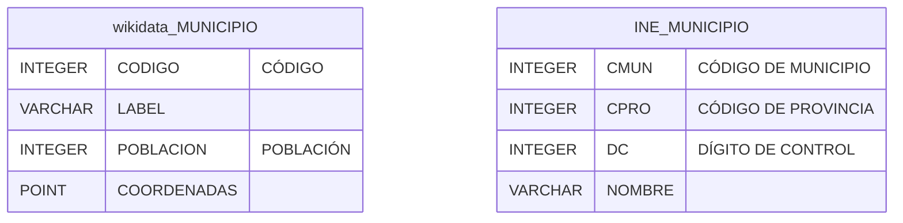
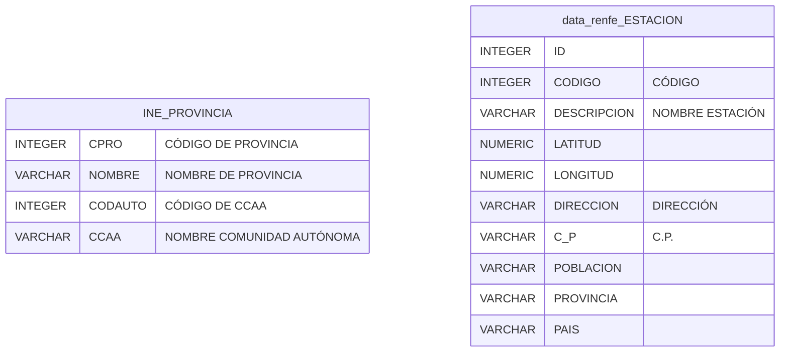
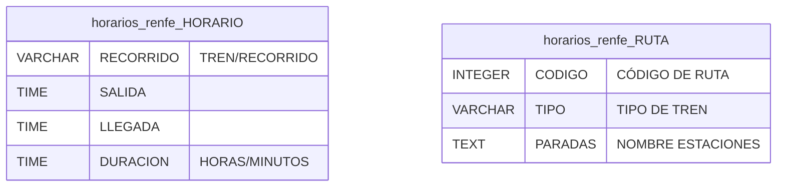
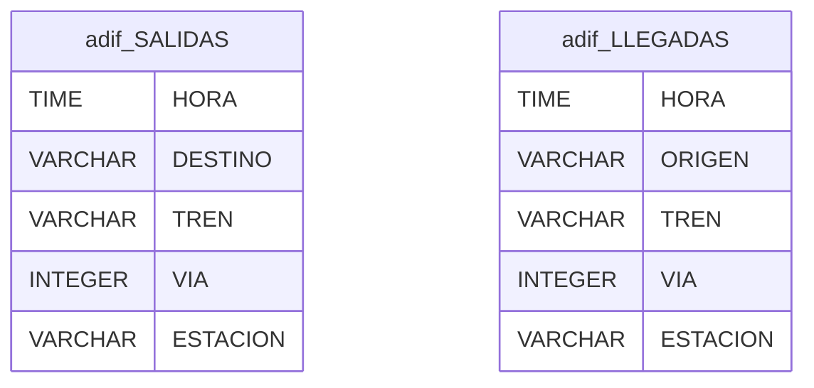

# Esquemas Origen

En este documento se muestran los esquemas de las fuentes de datos origen de nuestro sistema integrador Tren-ES. Las fuentes de datos son las siguientes:

- Wikidata. Para obtener información de los municipios, como su nombre, código del INE, coordenadas geográficas o la población. Para extraer estos datos utilizaremos un *punto sparql*
- INE. Para conectar los códigos de los municipios con las provincias y comunidades autónomas. Para extraer estos datos utilizaremos la *API oficial*.
- Renfe. Dos distintas:
    - Renfe Data. Obtenemos información a partir de la *API de Renfe* de todas las estaciones que existen en España.
    - Renfe horarios. Un pequeño formulario desde el que se puede obtener la información de todos los horarios de tramos (Estación Origen, Estación Destino) disponibles en la web de renfe y las rutas correspondientes. Para extraer estos datus utilizaremos *web scraping*.
- ADIF. Información en tiempo real de las salidas y llegadas en cada estación. Nos permite contrastar los horarios planificados con los reales. Para extraer estos datus utilizaremos *web scraping*.

## Forma conjuntiva de las tablas origen

* wikidata_MUNICIPIO(codigo INTEGER, label VARCHAR(255), poblacion INTEGER, coordenadas POINT)
Tabla de datos extraidos de Wikidata. La tabla está formada por un campo `codigo` que contiene el identificador INE del municipio, un campo `label` con el nombre del municipio en texto legible, la columna `poblacion` que almacena el número de habitantes de ese municipio y las `coordenadas`, una tupla de tipo Point que almacena las coordenadas geográficas de dicho municipio.
* INE_MUNICIPIO(cmun INTEGER, cpro INTEGER, dc INTEGER, nombre VARCHAR(100))
Datos oficiales sobre municipios ofrecidos por el INE. Formados por un código de municipio `cmun`, que identifica a un municipio *dentro* de una provincia, el código de la provincia a la que pertenece, `cpro`, un dígito de control (que no nos genera interés) `dc` y el nombre en texto legible, `nombre`.
* INE_PROVINCIA(cpro INTEGER, nombre VARCHAR(100), codauto INTEGER, ccaa VARCHAR(100))
Datos oficiales sobre provincias ofrecidos por el INE. Es una tabla que cruza provincias con su respectiva comunidad autónoma. Formada por la información de provincia, `cpro` y `nombre`, código de la provincia y nombre en texto legible respectivamente, e información sobre la Comunidad Autónoma a la que pertenece, `codauto` y `ccaa`, código de la Comunidad Autónoma y nombre en texto legible respectivamente.
* data_renfe_ESTACION(id INTEGER, codigo INTEGER, descripcion VARCHAR(255), latitud NUMERIC(9,6), longitud NUMERIC(9,6), direccion VARCHAR(255), c_p VARCHAR(5), poblacion VARCHAR(100), provincia VARCHAR(100), pais VARCHAR(100))
Este esquema, se ofrece en la sección de datos abiertos de Renfe. Contiene información sobre todas las estaciones de trenes que hay en España. Se compone por, un `id` de asignación secuencial, un código de estación `codigo`, el nombre en texto legible guardado en `descripción`, las coordenadas geográficas por separado en `latitud` y `longitud`, una dirección guardada en la columna `direccion` y el código postal asociado `c_p` y finalmente datos territoriales de la ubicación, `población`, `provincia` y `pais`.
* horarios_renfe_HORARIO(recorrido VARCHAR(255), salida TIME, llegada TIME, duracion INTERVAL)
Datos extraídos de un formulario de la página de Renfe. El horario son viajes que van desde una estación de origen hasta una de destino. `recorrido` es la ruta que realiza ese viaje, `salida` y `llegada` son las estaciones que une dicho viaje (y que son paradas de la ruta). Duración es el tiempo en horas y minutos que tarda en completarse el viaje.
* horarios_renfe_RUTA(codigo INTEGER, tipo VARCHAR(20), paradas TEXT)
Se extraen del mismo formulario, contiene información sobre una ruta en específico. Las rutas son conjuntos de estaciones que se recorren en un orden específico. Una ruta tiene un `codigo` que la identifica frente al resto, y un `tipo` de tren que la recorre (MD, AV, AVLO, ...) y `paradas` representa la lista de paradas. Sabemos que no es una representación normalizada, pero nos parecía que añadía mucha complejidad a representar los orígenes, y por motivos de simpleza lo hemos hecho así. En el esquema mediador se trata y soluciona este problema.
* adif_SALIDAS(hora TIME, destino VARCHAR(255), tren VARCHAR(100), via INTEGER, estacion VARCHAR(255))
Información accesible desde las páginas de datos en tiempo real sobre las estaciones españolas. Contiene información sobre las salidas en tiempo real. `hora` es el cuándo sale el tren de la estación, el campo `destino` contiene la estación destino de dicha salida, `tren` almacena tanto la ruta de dicho viaje que sale como el tipo de tren que la atiende, una columna `via` desde dónde es dicha salida y `estacion` la estación de la que provienen los datos.  
* adif_LLEGADAS(hora TIME, origen VARCHAR(255), tren VARCHAR(100), via INTEGER, estacion VARCHAR(255))
La entidad de llegadas contiene la misma información que salidas, pero intercambiando cualquier dato por los correspondientes a las llegadas.

