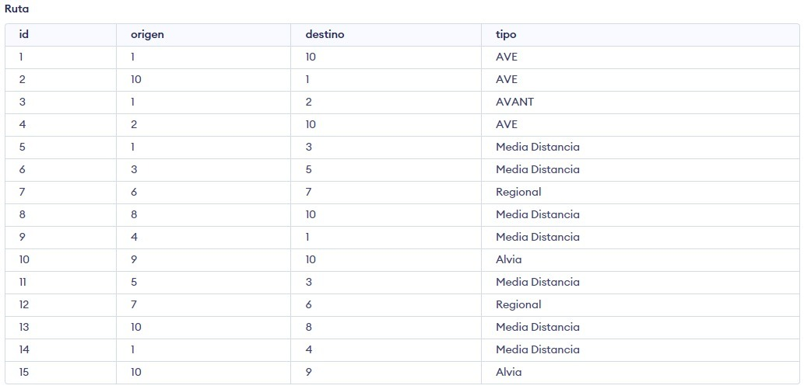
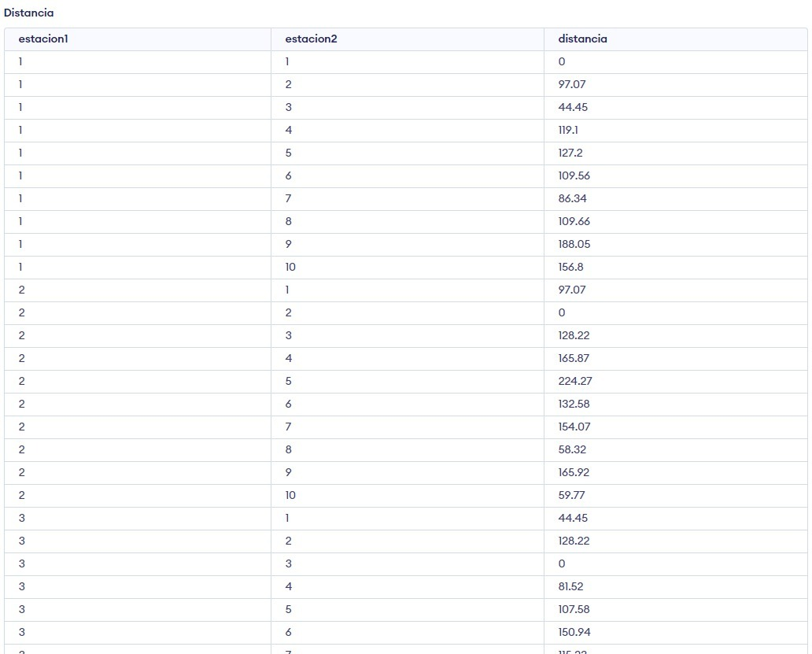
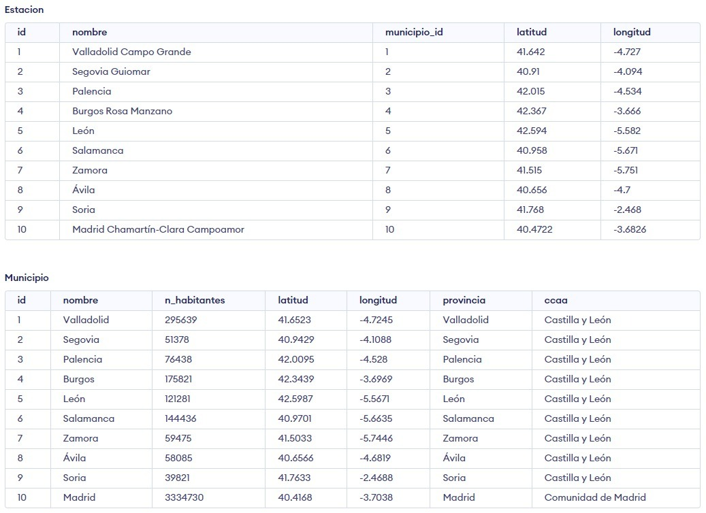
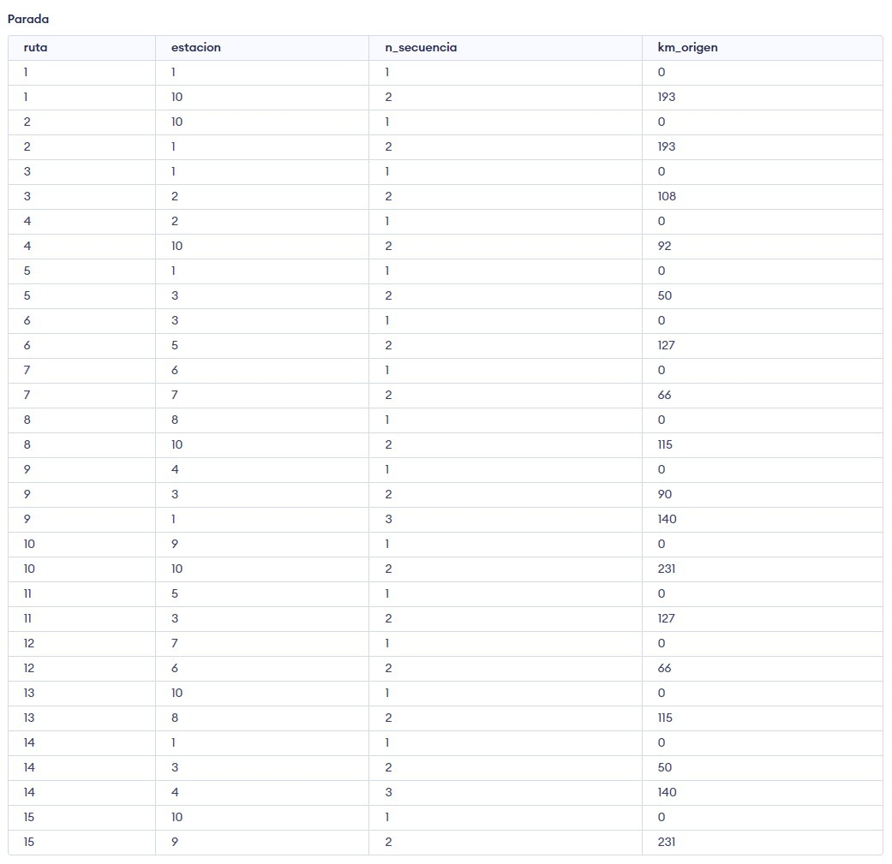
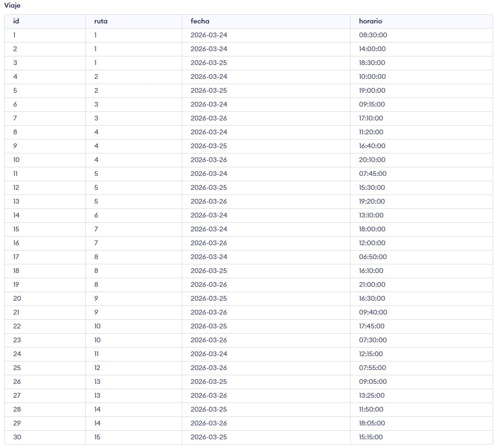

## Formulación SQL de las consultas

Podemos formular las consultas de la siguiente manera

1. **Estaciones de tren en poblaciones de menos de 10000 habitantes.** 
```sql
SELECT E.id, E.nombre AS estacion, M.nombre AS municipio
	FROM Estacion AS E
	INNER JOIN Municipio AS M
		ON E.municipio = M.id
	WHERE M.n_habitantes < 10000;
```
2. **Viajes entre dos estaciones a menos de 30 km entre sí.**

Para la solución a esta consulta es importante ver a qué nos referimos con _distancia_: es la distancia euclídea directa entre las estaciones origen y destino a partir de su longitud y latitud. No tiene en cuenta el recorrido que haga, pudiendo ser este mayor que 30 km.

```sql
SELECT V.id
	FROM Viaje AS V
	INNER JOIN Ruta AS R
		ON V.ruta = R.id
	INNER JOIN Distancia AS D
		ON (R.origen = D.estacion1 AND R.destino = D.estacion2) OR
		(R.origen = D.estacion2 AND R.destino = D.estacion1)
	WHERE D.distancia < 30;
```
3. **Poblaciones de entre 20000 y 100000 habitantes en las que haya entre uno y cinco viajes programados hoy.**

Esta consulta en principio iba a ser **Poblaciones ... haya menos de cinco viajes programados hoy. El problema con esta consulta así formulada es que es necesario hacer un _OUTER JOIN_ para obtener aquellas poblaciones en las que haya 0 viajes programados, lo que daba problemas al poner las consultas en forma conjuntiva, por lo que hemos decidido realizar esta simplificación.

```sql
SELECT
    M.id,
    M.nombre,
    COUNT(DISTINCT V.id) AS num_viajes_hoy
FROM
    Municipio AS M
    INNER JOIN Estacion AS E ON E.municipio_id = M.id
    INNER JOIN Parada AS P ON P.estacion = E.id
    INNER JOIN Viaje AS V ON V.ruta = P.ruta
WHERE
    M.n_habitantes BETWEEN 20000 AND 100000
    AND V.fecha = CURRENT_DATE
GROUP BY
    M.id,
    M.nombre
HAVING
    COUNT(DISTINCT V.id) BETWEEN 1 AND 3;
```

## Captura de una instancia

En este apartado se muestran las capturas de instancias específicas del esquema mediador:





