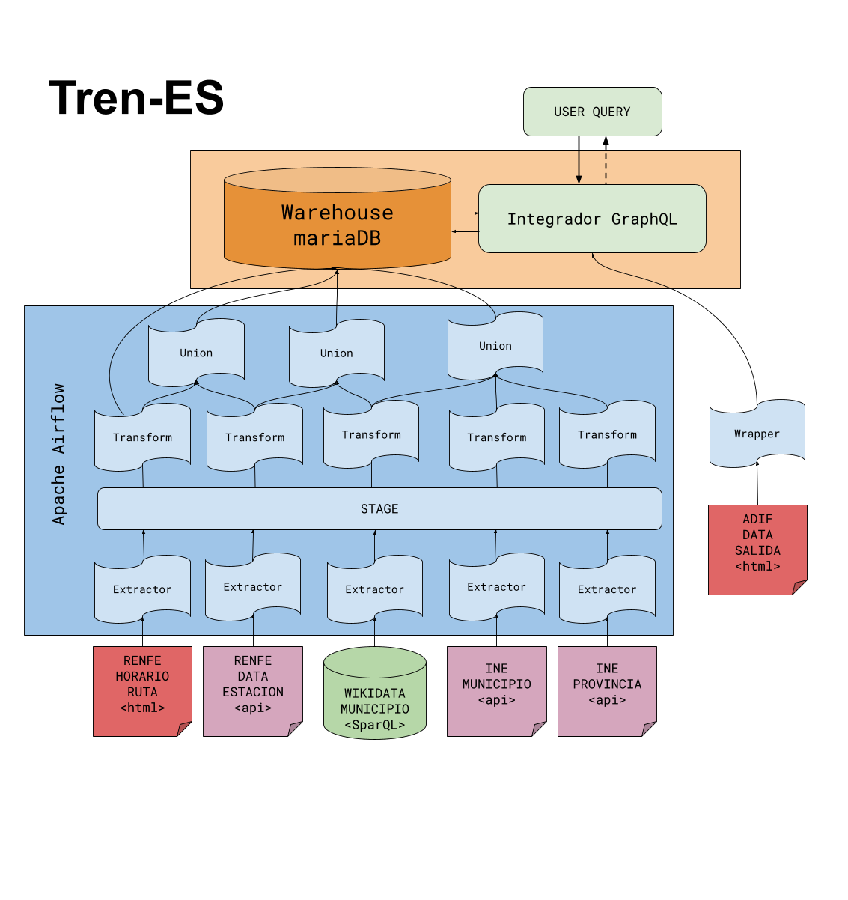

# Integración final

Hemos optado por un sistema integrador híbrido, combinando el Warhousing con técnicas de Integración Virtual. La motivación principal de esta hibridación es principalmente la diferencia entre las frecuencias de actualización de los datos. Por un lado tenemos fuentes como los datos de municipios y provincias proporcionados por el INE, que se actualizan cada mucho tiempo, frente a otras como las tablas de salidas de trenes en tiempo real en la página web de Adif, que se actualizan en periodos de segundos.

El _tech stack_ está formado por:

- Apache Airflow. Para extractores y pipelines.
- MariaDB. Base de datos relacional que almacena el Warehouse.
- GraphQL. Resolución de consultas sobre el esquema mediador.

A continuación se muestra una representación gráfica del sistema

\newpage

{ width=500px }

## Pipelines ETL

Los pipelines de extracción, transformación y carga de los datos se han implementado como DAGs de Airflow. El flujo es el siguiente:

```
EXTRACTOR S1 ----> TABLA STAGE (csv) -----+
                                          |
                                          |
                                          |
                                          |
EXTRACTOR S2 ----> TABLA STAGE (csv) ---- + ----> TRANSFORM ----> ESQUEMA WAREHOUSE
                                          |
                                          |
                                         ···
                                          |
                                          |
EXTRACTOR Sk ----> TABLA STAGE (csv) -----+

```

Cada fuente de datos tiene un DAG para la extracción y transformación a los esquemas definidos en los Esquemas Origen. Estos DAG producen unas tablas intermedias llamadas tablas Stage que nos permiten resolver los Esquemas del Mediador del Warehouse sin tener que repetir dichas extracciones. Por tanto el pipeline completo consiste en `Extracción > Stage > Transformación > Carga`. 

Los DAG de extracción están programados para ejecutarse de forma automática según las necesidades esperadas (diariamente, mensual, anual), además, se nos ocurrió implementar una serie de disparadores que lanzasen los DAG de transformación y carga del Warehouse una vez terminase la extracción de todas las fuentes origen de las que dependa cada esquema, pero no tuvimos tiempo de pensarlo e implementarlo bien.

## Integración Híbrida

Dependiendo de la consulta del usuario, si el sistema detecta que puede usar la fuente de datos en tiempo real de la web de Adif, este tratará de obtener la información mediante un scrapping web desdoblando la consulta por Integración Virtual. En ocasiones no es posible utilizar esa fuente (acceso denegado, petición erronea, etc), en esos casos, el sistema usa una fuente de datos menos actualizada/fiable almacenada en el Warehouse para dar respuesta.

> Hemos tenido problemas al realizar esta "hibridación" con la fuente alternativa del Warehouse debido al diseño del Esquema Mediador. Solo hemos conseguido que en caso de no poder acceder a la fuente de datos en tiempo real, se muestre un mensaje de error y unos resultados parcialmente incompletos a partir del Warehouse.
