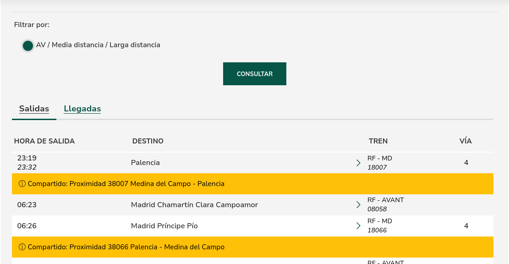

Desde la página web de consulta de horarios de estaciones en tiempo real de[ADIF](https://www.adif.es/viajeros/estaciones) hemos extraido mediante scrapping las tablas de las fuentes adif_SALIDAS y adif_LLEGADAS. No ha sido sencillo, pues es una aplicación web relativamente moderna y está bien preparada frente a interacción atomatizada, lo cuál ha resultado un reto. La implementación del scraping se puede ver en el archivo 'scraping_adif.py'. Este fichero actua a modo demo, por lo que no hay ningún tipo de interacción con el usuario. Simplemente accede a una página (la estación de Valladolid) y extrae las dos tablas. A continuación se procede a explicar la lógica y detalles técnicos:

Una petición http básica no era suficiente para poder acceder al contenido real, pues la aplicación respondía con un html especial indicando que el acceso no estaba permitido:

```{html}
<HTML>
<HEAD>
<TITLE>Access Denied</TITLE>
</HEAD>
<BODY>
<H1>Access Denied</H1>

You don't have permission to access "http&#58;&#47;&#47;www&#46;adif&#46;es&#47;w&#47;10600&#45;valladolid&#45;c&#46;&#45;g&#46;" on this server.<P>
Reference&#32;&#35;18&#46;e3d73b17&#46;1776287781&#46;10b628f9
<P>https&#58;&#47;&#47;errors&#46;edgesuite&#46;net&#47;18&#46;e3d73b17&#46;1776287781&#46;10b628f9</P>
</BODY>
</HTML>
```

por lo que tuvimos que rechazar una primera aproximación usando los módulos `requests` con `BeautifullSoup`. Por tanto, probamos a usar el módulo `playwright`, desarrollado por Microsoft y mucho más potente.

El módulo proporciona una interfáz muy sencilla para manejar versiones "headless" de un navegador, con el objetivo de simular la navegación de un usuario real, pudiendo interactuar con elementos de la aplicación sin simplemente limitarse a la respuesta de una petición básica. Aún así, el sistema de detección de "bots" de la web seguía respondiendo con ficheros html de rechazo, pues parece ser que también era capaz de identificar que se trataba de un navegador "headless". Pudimos solucionar este problema creando un nuevo "contexto" de navegador que simulase una ventana gráfica, pero sin que de verdad esta existiese; gracias a esto hemos sido capaces de acceder a la información.

El flujo del programa es muy simple:

1. Se crea una "ventana" virtual y una página sobre esta, posteriormente se navega a la ruta (para el caso de valladolid, [https://www.adif.es/w/10600-valladolid-c.-g.](https://www.adif.es/w/10600-valladolid-c.-g.)) y se espera a que todo el DOM esté en estado _attached_ para asegurar que los elementos a los que queremos acceder están disponibles en el momento de buscarlos.
2. Dependiendo de si se quieren estraer las tablas de llegadas o salidas, hay que pulsar un botón de "salidas" o no (la opción de "llegadas" parece que viene seleccionada por defecto). Este es el único paso diferente, a partir de aquí el programa es igual para ambos salvo alguna pequeña variante de notación. Para acceder a la tabla hay que filtrar por el identificador `#horas-trenes-estacion-(salidas|llegadas)` dependiendo de cual sea la fuente que se quiera extraer.



3. La extracción de información es la misma, pues usa los mismos identificadores para las columnas, incluso la estación de origen o destino también tiene el mismo identificador `col-destino` independientemente de si se habla de salidas o llegadas. Al ser una tabla, extraer los datos es tan sencillo como iterar sobre todos los objetos de tipo `tr` y acceder a cada elemento `td` por columna. Una cosa importante y que tuvimos que solucionar fue que hay dos tipos de "filas", las que contienen la información que nos interesa y las amarillas, que proporcionan información sobre problemas en la infrastructura, que no tienen el mismo formato y por tanto pueden producir errores si no se trata bien.
4. Finalmente, se "serializan" los datos extraidos en un csv usando la función de la librería estandar `csv.DictWritter`.
