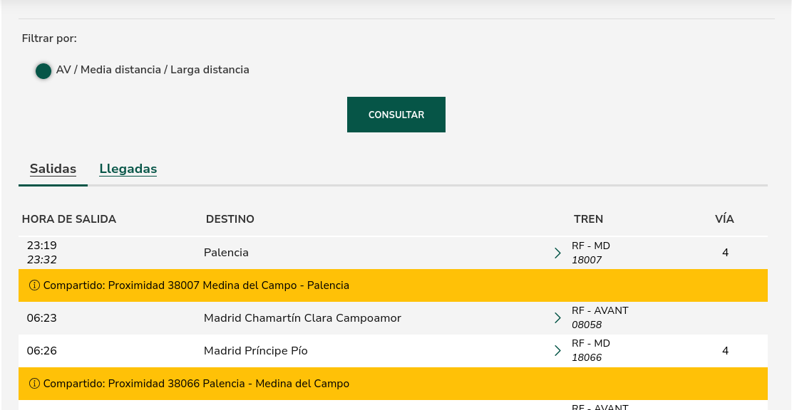

# Scraping

## ADIF

Desde la página web de consulta de horarios de estaciones en tiempo real de [ADIF](https://www.adif.es/viajeros/estaciones) hemos extraído mediante scraping las tablas de las fuentes adif_SALIDAS y adif_LLEGADAS. No ha sido sencillo, ya que se trata de una aplicación web dinámica que dificulta el acceso automatizado a los datos, lo cual ha supuesto un reto para la construcción del wrapper. La implementación del scraping se puede ver en el archivo 'scraping_adif.py'. Este fichero actua a modo demo, por lo que no hay ningún tipo de interacción con el usuario. Simplemente accede a una página (la estación de Valladolid) y extrae las dos tablas. A continuación se procede a explicar la lógica y detalles técnicos:

Una petición HTTP básica no era suficiente para acceder al contenido real, ya que la aplicación respondía con un documento HTML indicando que el acceso no estaba permitido:

```html
<HTML>
<HEAD>
<TITLE>Access Denied</TITLE>
</HEAD>
<BODY>
<H1>Access Denied</H1>

You don't have permission to access
</HTML>
```

por lo que tuvimos que rechazar una primera aproximación usando los módulos `requests` con `BeautifullSoup`. Debido a la naturaleza de la fuente de ADIF, necesitamos interactuar con una interfaz web dinámica. Por ello, probamos a utilizar el `scraper` como un `wrapper` manual que accede a la fuente, materializa el DOM y extrae los datos estructurados para las tablas adif_SALIDAS y adif_LLEGADAS.
Por tanto, probamos a usar el módulo `playwright`, desarrollado por Microsoft y mucho más potente.

El módulo proporciona una interfaz muy sencilla para manejar versiones "headless" de un navegador, con el objetivo de simular la navegación de un usuario real, pudiendo interactuar con elementos de la aplicación sin simplemente limitarse a la respuesta de una petición básica. Aún así, el sistema de detección de "bots" de la web seguía respondiendo con ficheros html de rechazo, pues parece ser que también era capaz de identificar que se trataba de un navegador "headless". Pudimos solucionar este problema creando un nuevo "contexto" de navegador que simulase una ventana gráfica, pero sin que de verdad esta existiese; gracias a esto hemos sido capaces de acceder a la información.

El flujo del programa es muy simple:

1. Se crea una "ventana" virtual y una página sobre esta, posteriormente se navega a la ruta (para el caso de valladolid, [https://www.adif.es/w/10600-valladolid-c.-g.](https://www.adif.es/w/10600-valladolid-c.-g.)) y se espera a que todo el DOM esté en estado _attached_ para asegurar que los elementos a los que queremos acceder están disponibles en el momento de buscarlos, debido a la estructura de HTML de los datos de la fuente.
2. Dependiendo de si se quieren estraer las tablas de llegadas o salidas, hay que pulsar un botón de "salidas" o no (la opción de "llegadas" parece que viene seleccionada por defecto). Este es el único paso diferente, a partir de aquí el programa es igual para ambos salvo alguna pequeña variante de notación. Para acceder a la tabla hay que filtrar por el identificador `#horas-trenes-estacion-(salidas|llegadas)` dependiendo de cual sea la fuente que se quiera extraer.



3. La extracción de información es la misma para ambas tablas, pues se utilizan los mismos identificadores para las columnas. Un caso particular es el de la estación de origen o destino, ya que en el HTML aparece con el mismo identificador `col-destino` independientemente de si se está consultando la tabla de salidas o la de llegadas. Esto supone una pequeña heterogeneidad semántica, ya que el mismo identificador técnico de la fuente puede representar información distinta según el contexto. Por ello, el programa interpreta este campo dependiendo de la tabla que se esté extrayendo.

Al ser una tabla, extraer los datos consiste en iterar sobre todos los objetos de tipo `tr` y acceder a cada elemento `td` por columna. Sin embargo, no todas las filas representan viajes. Hay dos tipos de filas: las que contienen la información que nos interesa y las filas amarillas, que proporcionan información sobre problemas en la infraestructura. Estas últimas no tienen el mismo formato ni representan tuplas válidas para las fuentes `adif_SALIDAS` y `adif_LLEGADAS`, por lo que deben tratarse de forma separada para evitar errores y no introducir ruido en los datos extraídos.

4. Finalmente, se serializan los datos extraídos en un CSV usando la función de la librería estándar `csv.DictWriter`. Esta serialización no es únicamente una operación de guardado, sino que materializa el resultado del wrapper: las filas HTML extraídas se transforman en registros estructurados acordes al esquema de las fuentes origen `adif_SALIDAS` y `adif_LLEGADAS`.

5. En resumen, el scraping de ADIF puede verse como la construcción de un wrapper manual sobre una fuente web semiestructurada. El programa se encarga de acceder a la página, interpretar su estructura HTML, resolver pequeñas heterogeneidades de la fuente y limpiar aquellas filas que no se ajustan al esquema esperado, generando finalmente datos estructurados que pueden ser utilizados por el sistema integrador.
