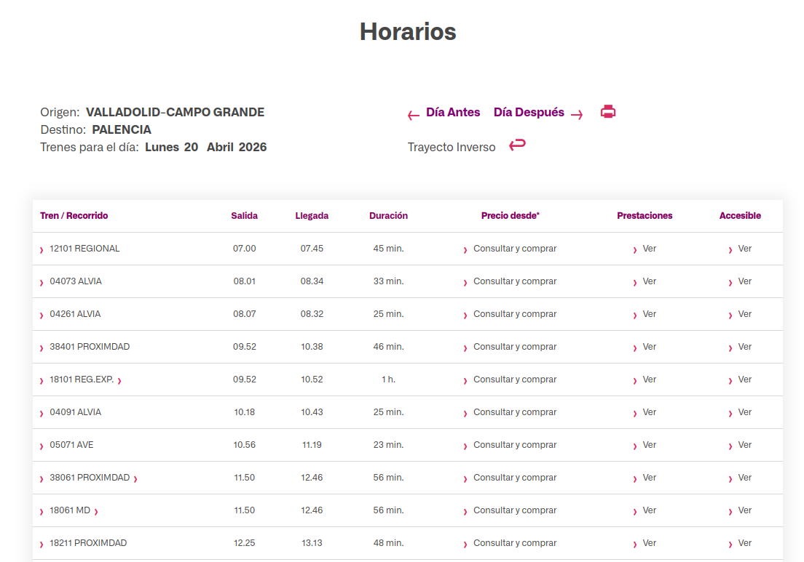
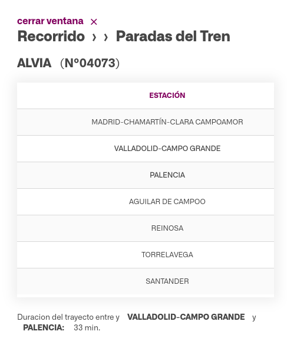

Hemos utilizado scraping sobre la web de [renfe horarios](https://www.renfe.com/es/es/viajar/informacion-util/horarios). Para conseguir esta información hemos tenido que rellenar un formulario utilizando *playwright* y *BeautifulSoup* en Python para acceder, ya que con la librería *requests* aparecían problemas para realizar el scraping.

El scraping realizado se puede ver en el archivo *scraping_renfe_horarios.py*, y el flujo del programa es el siguiente:

1. Se introduce al programa la información relativa al cuestionario con el siguiente formato: \[cod_estacion_origen\]-\[cod_estacion_destino\]-\[dia\]-\[mes\]-\[año\], de tal forma que para obtener los recorridos entre Valladolid Campo Grande (estación número 10600) y Palencia (estación número 14100) para el día 20 de abril de 2026 podríamos ejecutar el programa como:

```{bash}
$ echo "10600-14100-20-04-2026" | python3 scraping_renfe_horarios.py 
```

Como se puede ver, el programa solo hace scraping sobre dos estaciones para un día concreto. El motivo de esto es que todavía no heos obtenido el listado de todas las estaciones para poder hacer el scraping de todos los viajes, aunque el programa está preparado para soportar varias llamadas seguidas.

2. Se accede a la web, accediendo al *iframe* que contiene el formulario. Si no se accede a este iframe no se pueden obtener los elementos html del formulario. Cuando se accede, se rellenan los datos acorde a la entrada del programa y se hace click en el botón **BUSCAR**.

3. El *iframe* cambia y muestra una tabla como la de la imagen de debajo. Accedemos a cada linea de la tabla y obtenemos el primer valor, que redirige a otra página web mediante una función javaScript y un hiperenlace.



4. Formateamos el hiperenlace para hacerlo coincidir con el correcto. Esto equivale a eliminar saltos de línea y sustituir espacios en blanco por *%20*, de tal forma que la url:

```html
horarios.renfe.com/HIRRenfeWeb/recorrido.do?O=10600&D=14100&F=2026-04-20&T=04073&G=1&TT=ALVIA%20%20%20%20%20%20%20%20%20%20%20%20%20%20 &ID=s&FDS=2026-04-20&DT=33 min.
```

Equivale a la imagen de debajo.


5. Accedemos a estas url (una por ruta) y obtenemos el listado de paradas

6. Accedemos a dos archivos csv, correspondientes a los Esquemas en Origen de *horarios_renfe_RUTA* y *horarios_renfe_HORARIO*, y rellenamos los datos. Accedemos a estos archivos en modo append: si no existen se crean y si existen se añade la nueva información al final (así podemos crear muchas llamadas al programa para diferentes rutas).

Por último, se ha añadido la opción *--verbose* para obtener logs del programa.