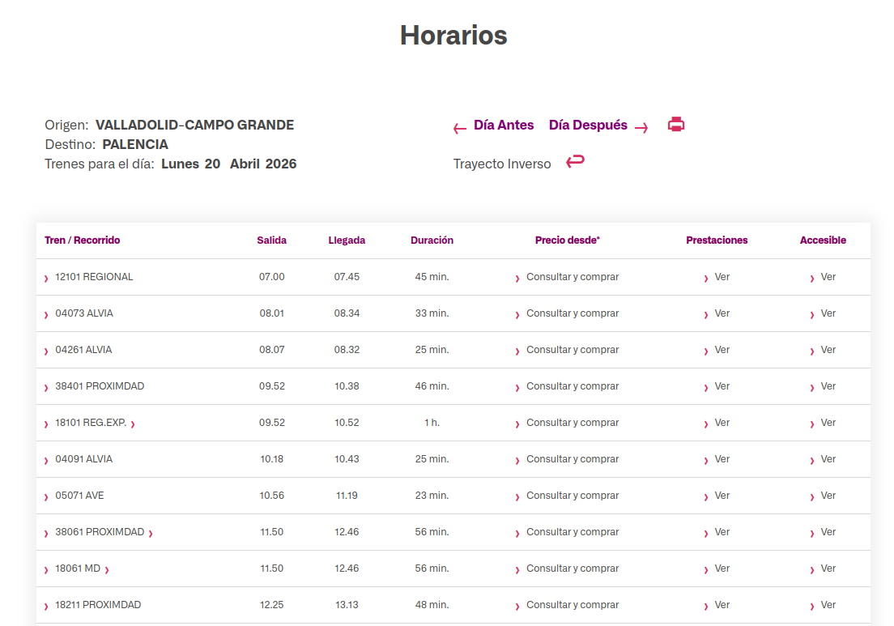
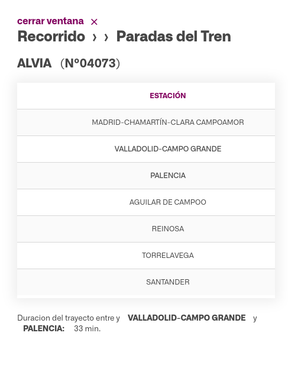

## RENFE

Hemos utilizado scraping sobre la web de [renfe horarios](https://www.renfe.com/es/es/viajar/informacion-util/horarios). Para acceder a la información ha sido necesario construir un wrapper que interactúe con el formulario de RENFE, ya que la fuente no expone directamente los datos como una tabla descargable ni como una API sencilla. En este caso, la fuente impone un patrón de acceso basado en los campos origen, destino y fecha, por lo que se ha utilizado `playwright` para simular la interacción con el formulario y `BeautifulSoup` para procesar el HTML resultante.

El scraping realizado se puede ver en el archivo *scraping_renfe_horarios.py*, y el flujo del programa es el siguiente:

1. Se introduce al programa la información relativa al formulario con el siguiente formato (que impone la web): \[cod_estacion_origen\]-\[cod_estacion_destino\]-\[dia\]-\[mes\]-\[año\], de tal forma que para obtener los recorridos entre Valladolid Campo Grande (estación número 10600) y Palencia (estación número 14100) para el día 20 de abril de 2026 podríamos ejecutar el programa como:

```{bash}
$ echo "10600-14100-20-04-2026" | python3 scraping_renfe_horarios.py 
```

Como se puede ver, el programa solo hace scraping sobre dos estaciones para un día concreto. El motivo de esto es que todavía no hemos obtenido el listado de todas las estaciones para poder hacer el scraping de todos los viajes, aunque el programa está preparado para soportar varias llamadas seguidas.

2. Se accede a la web y, dentro de ella, al *iframe* que contiene el formulario. Si no se accede a este *iframe*, no es posible obtener los elementos HTML necesarios para realizar la consulta. Este paso forma parte del programa de extracción del *wrapper*, ya que es necesario localizar dentro del DOM el formulario que permite consultar la fuente. Una vez localizado, se rellenan los datos de acuerdo con la entrada del programa y se hace clic en el botón **BUSCAR**.

3. El *iframe* cambia y muestra una tabla como la de la imagen de debajo. Accedemos a cada línea de la tabla y obtenemos el primer valor, que redirige a otra página web mediante una función JavaScript y un hiperenlace.



4. Normalizamos el hiperenlace para que el valor extraído del HTML sea compatible con el formato esperado por la fuente. Se trata de resolver una heterogeneidad sintáctica producida por saltos de línea y espacios en blanco en la representación de la URL. Para ello, se eliminan los saltos de línea y se sustituyen los espacios en blanco por *%20*, de tal forma que la url:

```html
horarios.renfe.com/HIRRenfeWeb/recorrido.do?O=10600&D=14100&F=2026-04-20&T=04073&G=1&TT=ALVIA%20%20%20%20%20%20%20%20%20%20%20%20%20%20 &ID=s&FDS=2026-04-20&DT=33 min.
```

Equivale a la imagen de debajo.


5. Accedemos a estas URL (una por ruta) y obtenemos el listado de paradas.

6. Accedemos a dos archivos CSV, correspondientes a los esquemas origen de *horarios_renfe_RUTA* y *horarios_renfe_HORARIO*, y rellenamos los datos extraídos. Esta serialización permite transformar la información obtenida desde las páginas HTML en registros estructurados compatibles con el sistema integrador. Accedemos a estos archivos en modo *append*: si no existen se crean y, si existen, se añade la nueva información al final. De esta forma, podemos realizar muchas llamadas al programa para diferentes rutas sin sobrescribir los datos anteriores.


Por último, se ha añadido la opción *--verbose* para obtener logs del programa y facilitar la revisión del proceso de extracción.